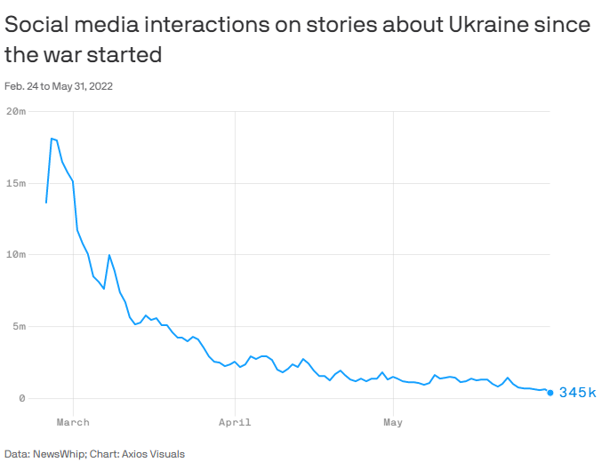

```{r setup, include=FALSE}
knitr::opts_chunk$set(echo = TRUE)

library(wordcloud)
library(RColorBrewer)
library(tibble)
library(httr)
library(Rfacebook)
library(XML)
library(twitteR)
library(openssl)
library(httpuv)
library(base64enc)
library(ROAuth)
library(rtweet)
library(tidytext)
library(stringr)
library(lubridate)
library(scales)
library(purrr)
library(rbokeh)
library(broom)
library(viridis)
library(tibbletime)
library(glue)
library(ggtext)
library(tidyverse)
options(scipen=999)
setwd(".")
```
```{r rmd style, include=FALSE, warning=FALSE}
library(xaringanthemer)
style_mono_accent(
  base_color = "#23395b",
  header_font_google = google_font("Josefin Sans"),
  text_font_google   = google_font("Montserrat", "300", "300i"),
  code_font_google   = google_font("Fira Mono")
)
```

## 문제의식
"World looks elsewhere as Ukraine war hits 100 days"  
https://www.axios.com/2022/06/02/ukraine-russia-war-social-media-interest  
"우크라전 100일 되자 소셜미디어 관심 96％ 감소"  
https://www.yna.co.kr/view/AKR20220603051700009
<center>

</center>
  
러시아의 우크라이나 침공이 장기화 되면서, 전쟁에 대한 관심도가 초기에 비하여 큰 폭으로 감소했다는 분석이 나왔다. 전쟁 발발 100일을 맞아 Axios가 좋아요 개수, 댓글 개수, 공유 횟수 등을 기반으로 계산한 sns 상의 상호작용 정도는 전쟁 초와 비교하여 96프로 감소하였다. 언론 보도 역시 첫 주에 52만건의 기사가 나온 것과 비교하여, 현재 7만건으로 까지 감소하였다. Axios는 관심과 보도의 급격한 감소에는, 전쟁 관련 뉴스에 대한 피로감이 쌓이고 조니뎁 앰버허드 재판 공방 등의 다른 이슈로 대중의 관심이 쏠린 것이 영향을 미쳤다고 분석했다.  
 미국의 유력 정치인들의 경우에는 러시아-우크라이나 전쟁에 대한 관심은 어떻게 변화했을까? 대중의 관심 감소, 다가오는 중간 선거에서 쟁점이 되는 새로운 이슈들(석유 가격 상승과 인플레이션, roe v. wade 판결의 파기 여부, 이민)의 부상은 러시아-우크라이나 전쟁에 대한 정치인들의 관심을 돌렸는가? 정치인간, 정당간 차이는 존재할까?


## 조사방법
### 트윗 분석
이러한 궁금증을 해결하기 위하여 미국의 정치인들이 사용하는 대표적인 sns 플랫폼인 트위터에서 정치인들의 트윗을 분석하여. 러시아-우크라이나 전쟁 관련 단어들의 빈도와 빈도의 변화를 확인하기로 하였다. 주로 페이스북 유튜브 등을 활용하는 한국의 정치인들과 달리, 미국에서는 대통령, 상하원의 양당 지도자, 대선 주자 등이 트위터를 이용하여 활발한 소통을 진행한다. 이번 조사에서 선정한 민주당, 공화당 양당 유력 정치인들 7명은, 2022년에 들어와서 주당 최소 5건, 최대 100여건의 트윗을 전송했기 때문에 특정 정치 이슈에 대한 관심도를 측정하기 위하여 적합한 자료라고 판단하였다.

```{r echo=FALSE}
twitter_token <- readRDS("../token/twitter_token.rds")
```

### search_tweets 기능을 통해 rtweet package 기능 점검
```{r example, cache  = TRUE}
st_ukraine <- 
  search_tweets(q="#ukraine", n = 1000, include_rts = FALSE, lang = "en", token = twitter_token)

st_ukraine_kor <- 
  search_tweets(q="우크라이나", n = 100000, include_rts = FALSE,token = twitter_token)
```

### 주요 정치인 대상 선정
민주당에서는  
1. 대통령 바이든  
2. 하원의장 낸시 펠로시  
3. 상원 예산위원장이자 민주당내 진보(progressive) 진영 중 대선 지지율 1위를 기록하는 버니 샌더스  
4. 외무를 담당 하고 있는 국무부 장관 앤서니 블링컨을 선정하여 분석을 진행하였다.
```{r 민주당 정치인들, cache = TRUE}
tml_biden <- get_timeline("POTUS", n = 3200, type = "recent", token = twitter_token)
tml_pelosi <- get_timeline("SpeakerPelosi", n = 3200, type = "recent", token = twitter_token)
tml_sanders <- get_timeline("SenSanders", n = 3200, type = "recent", token = twitter_token)
tml_blinken <- get_timeline("SecBlinken", n = 3200, type = "recent", token = twitter_token)
# 블링켄 국무장관은 2021년 장관 지명 이후 트위터 계정을 @ablinken에서 @SecBlinken으로 이동
```

공화당에서는 트위터 계정이 정지된 트럼프 전 대통령을 제외하고  
1. 하원 소수당 지도자(공화당 원내대표) 케빈 매카시  
2. 상원 소수당 지도자(공화당 원내대표) 미치 매코널  
3. 플로리다주 주지사이며 공화당 대선후보 조사에서 트럼프를 이은 2위를 달리고 있는 론 드산티스를 선정하였다.
```{r 공화당 정치인들, cache = TRUE}
tml_mccarthy <- get_timeline("GOPLeader", n = 3200, type = "recent", token = twitter_token)
tml_McConnell <- get_timeline("LeaderMcConnell", n = 3200, type = "recent", token = twitter_token)
tml_DeSantis <- get_timeline("GovRonDeSantis", n = 3200, type = "recent", token = twitter_token)
tml_Cruz <- get_timeline("tedcruz", n = 3200, type = "recent", token = twitter_token)
```

```{r cache = TRUE}
#민주당
tweet_biden <- tml_biden %>%
  mutate(person = "Biden") %>% select(c(91,5,3))
tweet_pelosi <- tml_pelosi %>%
  mutate(person = "Pelosi") %>% select(c(91,5,3))
tweet_sanders <- tml_sanders %>%
  mutate(person = "Sanders") %>% select(c(91,5,3))
tweet_blinken <- tml_blinken %>%
  mutate(person = "Blinken") %>% select(c(91,5,3))
tweet_dems <- bind_rows(tweet_biden, tweet_pelosi, tweet_sanders, tweet_blinken) %>% mutate(party = "민주당")
#공화당
tweet_mccarthy <- tml_mccarthy %>%
  mutate(person = "Mccarthy") %>% select(c(91,5,3))
tweet_desantis <- tml_DeSantis %>%
  mutate(person = "DeSantis") %>% select(c(91,5,3))
tweet_mcconnell <- tml_McConnell %>%
  mutate(person = "McConnell") %>% select(c(91,5,3))
tweet_cruz <- tml_Cruz %>%
  mutate(person = "McConnell") %>% select(c(91,5,3))
tweet_rep <- bind_rows(tweet_mccarthy, tweet_desantis, tweet_mcconnell, tweet_cruz) %>% mutate(party = "공화당")
#정치인 트윗들 합치기
tweet_politicians <- bind_rows(tweet_dems, tweet_rep) %>% mutate(timestamp = ymd_hms(created_at))
# 2022년 이후 트윗들만 선정
tweet_politicians_21 <- tweet_politicians %>% filter(timestamp >= as_date("2022-01-01"))
```


## 주요 정치인들의 트윗 단어 빈도와 상호 비교
```{r}
datebreaks <- seq(as.Date("2022-01-01"), as.Date("2022-06-01"), by = "1 month")
ggplot(tweet_politicians, aes(x = created_at, fill = person)) +
  geom_histogram(position = "identity", bins = 20, show.legend = FALSE)  +
    facet_wrap(~person, ncol = 3)
ggplot(tweet_politicians_21, aes(x = created_at, fill = person)) +
  geom_histogram(position = "identity", bins = 26, show.legend = FALSE) +
  scale_x_datetime('2022년',
                   date_breaks = '1 month',
                   date_labels = '%m월') +
  theme(axis.text.x = element_text(angle = 30, hjust = 1)) +
    facet_wrap(~person, ncol = 3)
```

```{r 정치인 트윗 tidy}}
remove_reg <- "&amp;|&lt;|&gt;"
tidy_tweet <- tweet_politicians_21 %>% 
  filter(!str_detect(text, "^RT")) %>%
  mutate(text = str_remove_all(text, remove_reg)) %>%
  unnest_tokens(word, text, token = "tweets") %>%
  filter(!word %in% stop_words$word,
         !word %in% str_remove_all(stop_words$word, "'"),
         str_detect(word, "[a-z]"))
```

```{r}
frequency_tweet <- tidy_tweet %>%
  count(person, word, sort = TRUE) %>% 
  left_join(tidy_tweet %>%count(person, name = "total")) %>%
  mutate(freq = n/total)

freq_word_tweet <- frequency_tweet  %>% 
  select(person, word, freq) %>% 
  pivot_wider(names_from = person, values_from = freq) %>%
  arrange(Biden, Pelosi, Blinken, Sanders, Mccarthy, DeSantis, McConnell)
freq_word_tweet
```
```{r}
freq_word_tweet %>% select(c(1,3)) %>% arrange(desc(Mccarthy))
```


### 바이든 vs 샌더스
```{r 정치인간 비교}
library(scales)

# Biden and Sanders
ggplot(freq_word_tweet , aes(Biden, Sanders)) +
  geom_jitter(alpha = 0.1, size = 2.5, width = 0.25, height = 0.25) +
  geom_text(aes(label = word), check_overlap = TRUE, vjust = 1.5) +
   geom_label( 
    data= freq_word_tweet %>% filter(word == "ukraine"|word == "ukraines"|word == "ukrainian"), 
    aes(label=word),
    label.padding = unit(0.3, "lines"), # Rectangle size around label
    label.size = 0.2,
    color = "#FFD500",
    fill="#005BBB"
  ) +
  geom_label( 
    data= freq_word_tweet %>% filter(word == "russia"|word == "russias"|word == "russian"), 
    aes(label=word),
    label.padding = unit(0.3, "lines"), # Rectangle size around label
    label.size = 0.2,
    color = "white",
    fill="red"
  ) +
  scale_x_log10(labels = percent_format()) +
  scale_y_log10(labels = percent_format()) +
  geom_abline(color = "red")
```

### 바이든 vs 드산티스
```{r}
# Biden and DeSantis
ggplot(freq_word_tweet , aes(Biden, DeSantis)) +
  geom_jitter(alpha = 0.1, size = 2.5, width = 0.25, height = 0.25) +
  geom_text(aes(label = word), check_overlap = TRUE, vjust = 1.5) +
   geom_label( 
    data= freq_word_tweet %>% filter(word == "ukraine"|word == "ukraines"|word == "ukrainian"), 
    aes(label=word),
    label.padding = unit(0.3, "lines"), # Rectangle size around label
    label.size = 0.2,
    color = "#FFD500",
    fill="#005BBB"
  ) +
  geom_label( 
    data= freq_word_tweet %>% filter(word == "russia"|word == "russias"|word == "russian"), 
    aes(label=word),
    label.padding = unit(0.3, "lines"), # Rectangle size around label
    label.size = 0.2,
    color = "white",
    fill="red"
  ) +
  scale_x_log10(labels = percent_format()) +
  scale_y_log10(labels = percent_format()) +
  geom_abline(color = "red")
```
  
DeSantis의 경우에는 2022년 트위터에서 우크라이나와 러시아에 대한 언급을 하지 않았기 때문에, 빈도 확인을 위해 로그를 취해준 그래프에서 관련 용어 label이 아예 나타나지 않았다는 점을 확인할 수 있다.

### 펠로시 vs 맥카시 (양당 하원 수장)
```{r 하원 지도자간 비교}
# House leaders vs

ggplot(freq_word_tweet, aes(Pelosi, Mccarthy)) +
  geom_jitter(alpha = 0.1, size = 2.5, width = 0.25, height = 0.25) +
  geom_text(aes(label = word), check_overlap = TRUE, vjust = 1.5) +
   geom_label( 
    data= freq_word_tweet %>% filter(word == "ukraine"|word == "ukraines"|word == "ukrainian"), 
    aes(label=word), position = "identity",
    label.padding = unit(0.3, "lines"), # Rectangle size around label
    label.size = 0.2,
    color = "#FFD500",
    fill="#005BBB"
  ) +
  geom_label( 
    data= freq_word_tweet %>% filter(word == "russia"|word == "russias"|word == "russian"), 
    aes(label=word), position = "identity",
    label.padding = unit(0.3, "lines"), # Rectangle size around label
    label.size = 0.2,
    color = "white",
    fill="red"
  ) +
  scale_x_log10(labels = percent_format()) +
  scale_y_log10(labels = percent_format()) +
  geom_abline(color = "red")
```

## log odds ratio를 이용한 단어 사용 차이 분석
```{r}
target <- data.frame(word_group = 
                       c("우크라이나", "우크라이나", "우크라이나","전쟁", "전쟁", "러시아", "러시아", "러시아"),
                     word =
                    c("ukraine","ukraines","ukrainian","peace","war","russia","russias","russian"))
```

### 바이든 vs 드산티스
```{r}
word_ratios_Biden_DeSantis <- tidy_tweet %>%
  filter(person == "Biden"|person == "DeSantis") %>%
  count(word, person) %>%
  group_by(word) %>%
  filter(sum(n) >= 10) %>%
  ungroup() %>%
  pivot_wider(names_from = person, 
              values_from = n, values_fill = 0) %>%
  mutate_if(is.numeric, list(~(. + 1) / (sum(.) + 1)))  %>%
  mutate(logratio = log(DeSantis/Biden)) %>%
  arrange(desc(logratio))

word_ratios_Biden_DeSantis %>% arrange(abs(logratio))
```
```{r}
 word_ratios_Biden_DeSantis %>%
  group_by(logratio < 0) %>%
  slice_max(abs(logratio), n = 20) %>% 
  ungroup() %>%
  mutate(word = reorder(word, logratio)) %>%
  ggplot(aes(word, logratio, fill = logratio < 0)) +
  geom_col(show.legend = FALSE) +
  coord_flip() +
  ylab("log odds ratio (DeSantis/Biden)")
```

### 바이든 vs 샌더스
```{r}
word_ratios_Biden_Sanders <- tidy_tweet %>%
  filter(person == "Biden"|person == "Sanders") %>%
  count(word, person) %>%
  group_by(word) %>%
  filter(sum(n) >= 10) %>%
  ungroup() %>%
  pivot_wider(names_from = person, 
              values_from = n, values_fill = 0) %>%
  mutate_if(is.numeric, list(~(. + 1) / (sum(.) + 1)))  %>%
  mutate(logratio = log(Biden/Sanders)) %>%
  arrange(desc(logratio))

word_ratios_Biden_Sanders %>% arrange(abs(logratio))

word_ratios_Biden_Sanders %>%
  group_by(logratio < 0) %>%
  slice_max(abs(logratio), n = 30) %>% 
  ungroup() %>%
  mutate(word = reorder(word, logratio)) %>%
  ggplot(aes(word, logratio, fill = logratio < 0)) +
  geom_col(show.legend = FALSE) +
  coord_flip() +
  ylab("log odds ratio (Sanders/Biden)") +
  scale_fill_discrete(name = "", labels = c("Sanders", "Biden"))
```

### 펠로시 vs 맥카시 (양당 하원 수장)
```{r}
word_ratios_houseleader <- tidy_tweet %>%
  filter(person == "Pelosi"|person == "Mccarthy") %>%
  count(word, person) %>%
  group_by(word) %>%
  filter(sum(n) >= 10) %>%
  ungroup() %>%
  pivot_wider(names_from = person, 
              values_from = n, values_fill = 0) %>%
  mutate_if(is.numeric, list(~(. + 1) / (sum(.) + 1)))  %>%
  mutate(logratio = log(Mccarthy/Pelosi)) %>%
  arrange(desc(logratio))
```
```{r}
word_ratios_houseleader %>% arrange(abs(logratio))

word_ratios_houseleader %>%
  group_by(logratio < 0) %>%
  slice_max(abs(logratio), n = 30) %>% 
  ungroup() %>%
  mutate(word = reorder(word, logratio)) %>%
  ggplot(aes(word, logratio, fill = logratio < 0)) +
  geom_col(show.legend = FALSE) +
  coord_flip() +
  ylab("log odds ratio (Pelosi/Mccarthy)") +
  scale_fill_discrete(name = "", labels = c("Peolsi", "Mccarthy"))
```


## 단어의 사용 양상 변화

단어를 사용한 횟수와 사용 시점(주별/월별)을 정치인 별로 정리한다.  
이 과정에서 유의미한 단어 사용 횟수를 집계하기 위하여 2022년 1월 1일 이후 30회 이상 언급한 단어들만을 분석 대상에 포함한다.
```{r}
words_by_time <- tidy_tweet %>%
  filter(!str_detect(word, "^@")) %>%
  mutate(time_floor = floor_date(timestamp, unit = "1 week")) %>%
  count(time_floor, person, word) %>%
  group_by(person, time_floor) %>%
  mutate(time_total = sum(n)) %>%
  group_by(person, word) %>%
  mutate(word_total = sum(n)) %>%
  ungroup() %>%
  rename(count = n) %>%
  filter(word_total > 30)

words_by_month <- tidy_tweet %>%
  filter(!str_detect(word, "^@")) %>%
  mutate(time_floor = floor_date(timestamp, unit = "1 month")) %>%
  count(time_floor, person, word) %>%
  group_by(person, time_floor) %>%
  mutate(time_total = sum(n)) %>%
  group_by(person, word) %>%
  mutate(word_total = sum(n)) %>%
  ungroup() %>%
  rename(count = n) %>%
  filter(word_total > 30)

words_by_time
```


```{r}
nested_data <- words_by_time %>%
  nest(data = c(-word, -person))
```

#### 유의미한 단어 사용 양상 변화 찾기
```{r}
nested_models <- nested_data %>%
  mutate(models = map(data, ~ glm(cbind(count, time_total) ~ time_floor, ., 
                                  family = "binomial")))

slopes <- nested_models %>%
  mutate(models = map(models, tidy)) %>%
  unnest(cols = c(models)) %>%
  filter(term == "time_floor") %>%
  mutate(adjusted.p.value = p.adjust(p.value))
```


가장 급격한 사용의 변화를 보였던 단어들을 확인하기 위하여 slope에서 p.value 0.05 이하의 값을 보인 단어들을 확인해본다.
```{r}
top_slopes <- slopes %>% 
  filter(adjusted.p.value < 0.05)

top_slopes %>% dplyr::arrange(desc(adjusted.p.value))
```
```{r}
words_by_time %>%
  inner_join(top_slopes, by = c("word", "person")) %>%
  ggplot(aes(time_floor, count/time_total, color = word)) +
  geom_line(size = 1.3) +
  labs(x = NULL, y = "Word frequency") +
  facet_grid(~person)
```
  
급격한 변동을 보인 단어들을 분석해 보면
블링컨 국무장관의 경우에는 러시아-우크라이나 전쟁 관련 단어들(agression, ukraine, russia), 매카시 하원 원내대표의 경우에는 이민문제(border), 펠로시 하원의장의 경우에는 build back better법안(infrastructre)관련 언급이 큰 것을 확인할 수 있다. 

### 바이든 대통령의 경우
바이든 대통령의 경우 p value .05 미만 데이터가 없음으로 p value .1 미만 데이터를 확인해보자
```{r}
biden_models <- nested_models %>% filter(person == "Biden")
biden_slopes <- biden_models %>%
  mutate(models = map(models, tidy)) %>%
  unnest(cols = c(models)) %>%
  filter(term == "time_floor") %>%
  mutate(adjusted.p.value = p.adjust(p.value))
biden_top_slopes <- biden_slopes %>% 
  filter(adjusted.p.value < 0.1)

biden_top_slopes %>% arrange(desc(adjusted.p.value))

words_by_time %>%
  inner_join(biden_top_slopes, by = c("word", "person")) %>%
  ggplot(aes(time_floor, count/time_total, color = word)) +
  geom_line(size = 1.3) +
  labs(x = "2022년", y = "바이든 대통령 Word frequency")
```
  
일자리(jobs)와 build 단어가 급격한 사용 빈도 변화를 경험하였다.  
build의 경우에는 건설이나 구축 등의 의미로 쓰이는 경우 역시 많기 때문에, buildbackbetter 법안 외의 다른 영향에 대해서도 추가 검토가 필요하다.

## 러시아 우크라이나 전쟁 관련 단어의 언급 빈도 변화

### 월별, 단어별 분석
```{r}
war_by_month <- words_by_month %>% 
  filter(word %in% target$word) %>%
  inner_join(slopes, by = c("word", "person")) %>%
  left_join(target, by = "word")

war_by_month %>%
  ggplot(aes(time_floor, count/time_total, color = word)) +
  geom_line(size = 1.3) +
  scale_color_viridis(discrete = TRUE) +
  labs(x = "2022년", y = "Word frequency") +
  scale_color_discrete(name = "관련 단어 언급 빈도") +
  facet_grid(word_group ~ person)
```

### 주별, 단어 군집별 분석
더 자세한 변동을 확인하기 위하여 전쟁이 발발한 2022년 2월 24일(UTC 기준)이후의 주별 빈도를 확인해보자. ukaine ukraine(')s ukranian 과 같은 단어들의 경우 '우크라이나'라는 하나의 단어 그룹에 넣고 그 빈도를 더하여 확인할 수도 있을 것이다. '우크라이나' '러시아' '전쟁' 단어 군집을 설정하고, 관련 단어들을 각각의 그룹에 집어넣어 분석해 보았다.
```{r 전쟁 발발 이후 주 단위 분석}
war_by_time <-  words_by_time %>% 
  filter(word %in% target$word) %>%
  inner_join(slopes, by = c("word", "person")) %>%
  left_join(target, by = "word") %>%
  filter(time_floor >= as.Date("2022-02-24"))

war_by_time %>% 
  group_by(word_group, time_floor, time_total) %>%
  mutate(count_group = sum(count)) %>%
  ggplot(aes(time_floor, count_group/time_total, color = word_group)) +
  geom_line(size = 1.3) +
  scale_color_viridis(discrete = TRUE) +
  labs(x = "2022년", y = "Word frequency") +
  scale_color_discrete(name = "관련 단어 언급 빈도") +
  facet_grid(~person)
```
    
역시 블링컨 국무장관이 전쟁이 시작된 2월 말에서 3월 초순까지의 기간 동안 우크라이나에 관련된 단어들을 많이 사용하였으나. 전쟁이 장기와 됨에 따라 언급이 3분의 1 이하로 줄어들었다는 점을 확인할 수 있다. 주별 바이든 대통령과 펠로시 하원의장 역시 러시아-우크라이나 전쟁 관련 언급이 급격하게 증가한 기간(주로 4월 중순에서 말 사이 기간)이 있었지만, 6월에 들어서는 급격하게 언급 빈도가 감소한 것을 확인할 수 있다.  

시각화 과정에서 발생한 한가지 문제는 특정기간 동안 유의미한 횟수(30회) 이상의 언급을 하지 않은 경우 그림에서 나오지 않게 되었다는 점이다. 미치 매코널이나 론 드산티스와 같은 공화당 인사들은 우크라이나, 러시아, 전쟁 관련 단어들을 30회 이상 트윗에서 사용하지 않았다. 유일하게 변화를 추적할 수 있는 매카시 하원 원내대표 역시 4월 중순 이후로는 관련 언급이 거의 사라진 것을 확인할 수 있다. 정치인간 분석과 log odds ratio에서 드러난 공화당 인사들의 러시아-우크라이나 전쟁에 대한 소극적인 태도를 다시 한 번 확인할 수 있다.  

마지막으로 언급을 하지 않은 주의 데이터를 0으로 만들어준 후 geom_smooth를 통하여 추세를 확인한다.
```{r}
war_by_time_wide <- war_by_time %>% select(c(1,2,3,14,4,5)) %>% 
  pivot_wider(names_from=person, values_from=count)
war_by_time_wide[is.na(war_by_time_wide)] <- 0
war_by_time_full <- war_by_time_wide %>%
  pivot_longer(c(5:8), names_to="person", values_to="count")
```
```{r}
g1 <- war_by_time_full %>% 
  group_by(person, word_group, time_floor, time_total) %>%
  summarize(count_group = sum(count))

g1 %>%
  ggplot(aes(time_floor, count_group/time_total, color = word_group)) +
  geom_point(size = 1.3) +
  geom_smooth() +
  labs(x = "2022년", y = "Word frequency") +
  scale_color_discrete(name = "관련 단어 모음 언급 빈도") +
  facet_grid(~person)
```
  
블링컨 국무장관의 경우에는 언급 빈도가 다시 증가하는 추세라는 점을 확인할 수 있지만, 바이든 대통령과 펠로시 하원의장의 경우에는 언급이 거의 사라지고 있는 추세라는 점을 확인할 수 있다.

## 한계점 및 보완 방향
1. 정치인들의 트윗에 대한 리트윗, 좋아요, 인용등의 데이터를 반영한다면, 정치인들의 러시아- 우크라이나 전쟁에 대한 메시지에 대한 반응등을 확인할 수 있을 것이다.  
2. 주요 정치 변동 상황에 대한 축 반영, 쟁점이 되고 있는 의제 관련단어 분석등이 이루어진다면, 관심 정도를 다른 이슈와 비교하여 분석할 수 있을 것이다.  
3. 우크라이나, 러시아, 전쟁 관련 단어들이 사용되는 맥락이나, 정치인의 입장에 대해서는 보다 정성적인 검토가 필요하다.

```{r}
issues <- data.frame(
  word_group = c("우크라이나", "우크라이나", "우크라이나",
                 "전쟁", "전쟁", 
                 "러시아", "러시아", "러시아", 
                 "낙태", "낙태",
                 "선거", "선거",
                 "총기","총기", "총기","총기",
                 "이민", "이민",
                 "경찰", "경찰",
                 "물가", "물가", "물가", "물가","물가","물가",
                 "1월6일 폭동", "1월6일 폭동"),
          word = c("ukraine","ukraines","ukrainian",
                   "peace","war",
                   "russia","russias","russian",
                   "roe", "reproductive",
                   "election", "midterm",
                   "guns", "gun", "NRA", "2nd",
                   "border", "mexicans",
                   "police", "profiling",
                   "inflation", "prices", "gas", "oil", "energy", "shortage",
                   "jan6", "inssurection"))
```


```{r}
issue_by_month <- words_by_month %>% 
  filter(word %in% issues$word) %>%
  dplyr::inner_join(slopes, by = c("word", "person")) %>%
  dplyr::left_join(issues, by = "word")

issue_by_month %>%
  ggplot(aes(time_floor, count/time_total, color = word)) +
  geom_line(size = 1.3) +
  scale_color_viridis(discrete = TRUE) +
  labs(x = "2022년", y = "Word frequency") +
  scale_color_discrete(name = "관련 단어 언급 빈도") +
  facet_grid(word_group ~ person)
```


